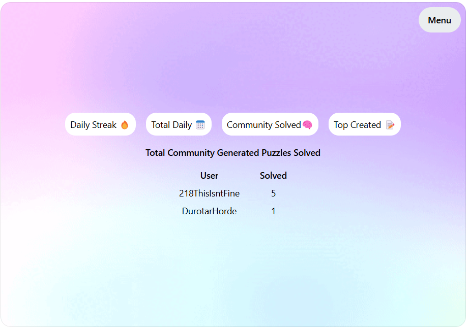
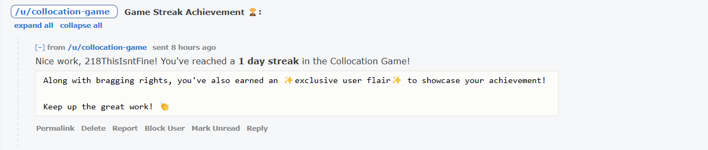
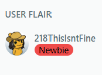

PhraseMe is a word-based puzzle game designed to challenge players to guess phrasemes—two words that frequently appear together in everyday language. These include common phrases like “hot water,” split-up compound words like “water-mark,” and famous names like “Mark Twain.” A “phraseme” is any fixed or semi-fixed expression in language, making it the perfect term for the collocated word pairs that players connect in this game. By solving these puzzles, players flex their linguistic intuition and have fun connecting the dots.

Start from the bottom up or top down (or swap between the two) and figure out all the words!
<video width="600" controls>

  <source src="./example-game.mp4" type="video/mp4">
  Your browser does not support the video tag.
</video>

Create your own puzzles for others to solve.
<video width="600" controls>

  <source src="./example-create.mp4" type="video/mp4">
  Your browser does not support the video tag.
</video>

Top the leaderboards for bragging rights

And get flair to show off your achievements.

